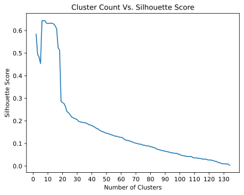
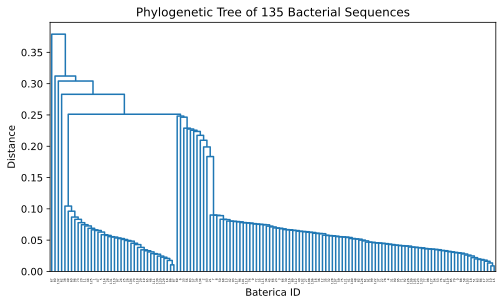

#  🧬 Bacterial Phylogenetic Analysis

A computational pipeline for analyzing evolutionary relationships between bacterial strains through protein sequence alignment, clustering, and phylogenetic tree reconstruction.

## Overview

This project analyzes 135 bacterial strains by aligning their protein sequences, computing similarity scores and distances, performing hierarchical clustering, and reconstructing a phylogenetic tree. The pipeline implements the Smith-Waterman algorithm for sequence alignment and uses agglomerative clustering with average linkage to infer evolutionary relationships.

## Methods

### Sequence Alignment

Protein sequences are aligned using the Smith-Waterman algorithm with dynamic programming:
- Gap penalty: -12
- Scoring matrix: BLOSUM62
- Local alignment approach to find optimal similarity scores

### Normalization

Raw similarity scores are normalized using geometric mean normalization to account for varying sequence lengths:

```
normalized_score = raw_score / sqrt(self_score_1 * self_score_2)
```

This produces length-independent scores between 0 and 1, where values closer to 1 indicate higher similarity.

### Distance Calculation

Distances are computed as the complement of normalized similarity:

```
distance = 1 - normalized_score
```

### Clustering and Tree Reconstruction

The pipeline uses agglomerative hierarchical clustering with average linkage to build the phylogenetic tree. The optimal number of clusters is determined using silhouette scores, which balance intra-cluster cohesion and inter-cluster separation.

## Data

The dataset comprises 135 bacterial protein sequences, including both naturally occurring strains and synthetically generated variants designed to explore sequence space and evolutionary patterns. 

**Data Source:** This analysis was conducted using sequences and methodological framework developed by **Borislav Hristov, Ph.D.**

### Dataset Characteristics

- 135 bacterial protein sequences
- Mixed composition of natural and synthetic strains
- Sequences selected to represent diverse evolutionary relationships
- Format: Tab-separated values (ID, sequence)
- Location: `./data/protein_sequences.txt`

### Acknowledgments

We gratefully acknowledge Dr. Borislav Hristov for providing the protein sequence dataset and analytical framework that enabled this phylogenetic investigation.

## Requirements

- Python 3.12
- numpy
- scipy
- scikit-learn
- blosum
- matplotlib

Install dependencies using the provided conda environment file:

```bash
conda env create -f environment.yml
conda activate <environment_name>
```

## Usage

Place your protein sequences in `./data/protein_sequences.txt` with the format:
```
ID\tSEQUENCE
```

Run the pipeline:

```bash
python main.py
```

## Output

The pipeline generates the following files in `./data/`:

- `similarity_matrix.txt` - Raw pairwise alignment scores
- `normalized_similarity_matrix.txt` - Geometric mean normalized scores
- `distance_matrix.txt` - Distance matrix (1 - normalized scores)
- `tree.svg` - Phylogenetic dendrogram
- `silhouette_cluster_count.svg` - Cluster quality analysis plot

The console output includes:
- Most similar and distant bacterial strain pairs
- Optimal cutting distance for clustering
- Number of clusters
- Silhouette score

## Implementation Details

The codebase is organized into four main modules:

- `alignment.py` - Smith-Waterman sequence alignment implementation
- `protein_seq_loader.py` - Data loading, matrix computation, and distance calculations
- `visual.py` - Clustering analysis and visualization
- `main.py` - Pipeline orchestration

## Performance

Estimated runtime: 8 minutes on Apple M4 Pro for 135 bacterial sequences.

## Example Visualizations

### Cluster Quality Analysis



The plot demonstrates the relationship between the number of clusters and silhouette score. The optimal number of clusters is identified in the range of 5-10, with the score dropping significantly beyond 20 clusters.

### Phylogenetic Tree



The dendrogram visualizes the hierarchical relationships between 135 bacterial sequences. The tree reveals one large cluster on the right side and several smaller branches on the left, consistent with the optimal cluster count of 6 identified through silhouette analysis.